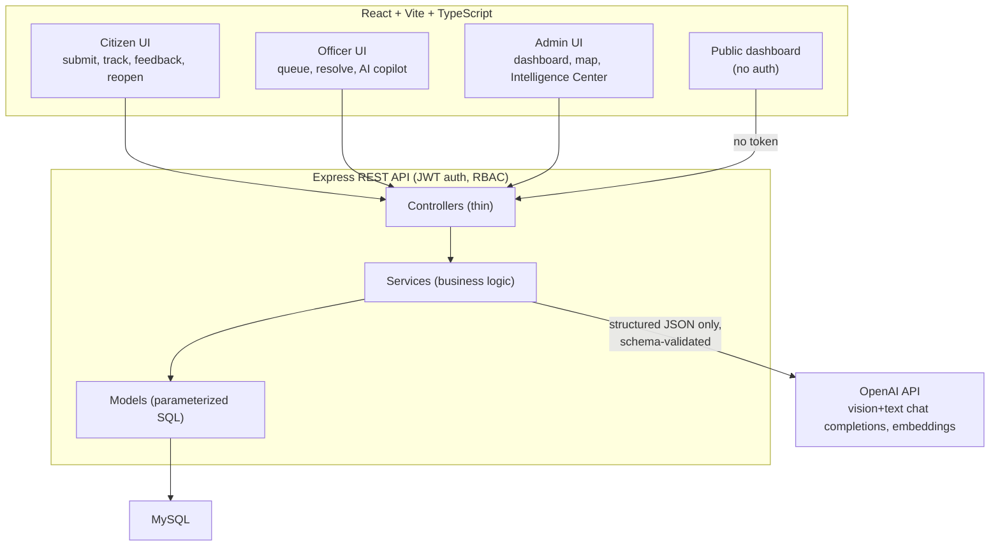
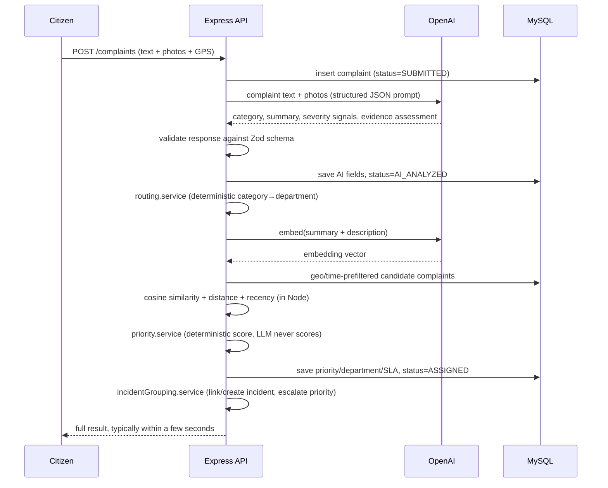
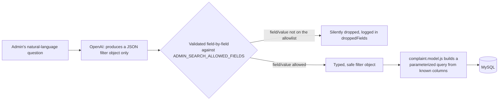

# Architecture

This document describes how Civic Connect's pieces fit together, and — the most important
rule in the whole system — **where AI's job ends and deterministic backend logic takes
over.**

> **AI provides intelligence and signals. Deterministic backend services make every
> operational decision** (priority score, department routing, SLA deadline, incident
> escalation, which database rows a search returns). The LLM is never the last word on
> anything that affects a citizen's complaint outcome.

## System overview



**Controller → Service → Model.** Controllers parse the request, check role/ownership, and
call a service. Services hold all business logic (priority, routing, SLA, duplicate
detection, hotspot detection, escalation, admin search sanitization). Models are the only
layer that touches SQL, and every query is parameterized — no string-concatenated SQL
anywhere in the codebase, and *especially* never SQL built from an LLM's output (see
[AI Admin Search](#ai-admin-search-security-boundary) below).

## Directory structure

```
backend/
  src/
    config/        env, MySQL pool, OpenAI client
    controllers/    thin HTTP handlers
    services/
      ai/           OpenAI calls + prompt building + response schema validation
      admin/        AI admin search, AI situation reports
      complaint/    priority, routing, SLA, status transitions, hotspots, escalation,
                    officer assignment, reopen, the analysis pipeline orchestrator
      duplicate/    embedding-based duplicate detection, incident grouping/escalation
      analytics/    aggregate SQL for dashboards/analytics/public stats
      notification/ in-app notifications
    models/         one file per table, raw parameterized mysql2 queries
    routes/         Express routers, one per resource
    middleware/     auth, RBAC, validation, upload, error handling
    validators/     Zod schemas for request bodies
  database/
    migrations/     plain SQL, applied in order by migrate.js
    seed.js, seed-complaints.js
  tests/
    unit/           deterministic services, mocked models/DB
    api/            supertest against the real Express app (AI calls mocked)

frontend/
  src/
    pages/          citizen/, officer/, admin/ route screens
    components/      common/, layout/, complaint/, map/, dashboard/, admin/
    services/        one file per backend resource, thin axios wrappers
    context/          AuthContext (JWT in localStorage)
```

## The AI pipeline (high level — see `ai-pipeline.md` for the full walkthrough)



## Civic Intelligence Center (Section 10)

`GET /api/admin/intelligence` combines, in one response:
- **Deterministic aggregates** (`analytics.service`) — never touched by AI.
- **Hotspot clusters** (`hotspot.service`) — a pure geo/time/category greedy-clustering
  algorithm, no ML model, no AI call.
- **The most recent AI situation report**, if one was generated in the last 24 hours (it is
  *never* auto-generated on page load — see [Performance](#performance--observability)).
- An SLA escalation check runs as part of building this response, so opening the page is
  also what "ticks the clock" for SLA notifications (see the note in the README's
  Limitations section about there being no real job scheduler in this build).

## AI Admin Search — security boundary

This is the most security-sensitive feature in the phase-2 build, so it gets its own
diagram:



The model **never** produces SQL, and its raw JSON output is re-validated against
`ADMIN_SEARCH_ALLOWED_FIELDS` (`backend/src/utils/constants.js`) before touching the
database — every field is checked against an explicit enum or type, unknown fields are
dropped, `department_code`/`ward_code` are resolved against the live table (never trusted
as an id), and even `limit` is clamped. See `services/admin/adminSearch.service.js:sanitizeFilters`
and its dedicated test suite (`tests/unit/adminSearch.service.test.js`).

## Deterministic engines

| Engine | File | Decides |
|---|---|---|
| Priority | `services/complaint/priority.service.js` | Score 0-100 from base category severity + severity signals + duplicate count + age |
| Routing | `services/complaint/routing.service.js` | Category → department (one lookup table) |
| SLA | `services/complaint/sla.service.js` | Deadline from priority level; ON_TRACK/APPROACHING/BREACHED |
| SLA escalation | `services/complaint/escalation.service.js` | When to notify officer/admin (once per threshold crossing) |
| Duplicate detection | `services/duplicate/duplicateDetection.service.js` | Cosine similarity (AI-provided embeddings) + distance + recency, combined with configured weights |
| Incident grouping/escalation | `services/duplicate/incidentGrouping.service.js` | Which incident a complaint joins; incident priority bonus from geographic concentration + duration |
| Hotspot detection | `services/complaint/hotspot.service.js` | Geo/time/category greedy clustering |
| Officer assignment | `services/complaint/officerAssignment.service.js` | Ranks officers by current workload, critical-assignment count, proximity |
| Admin search sanitizer | `services/admin/adminSearch.service.js` | Which AI-proposed filter fields are safe to execute |

All thresholds/weights live in `backend/src/utils/constants.js` — one file, documented
inline, nothing scattered through the codebase.

## Performance & observability

- The AI pipeline runs **synchronously** on complaint submission (not queued/background) so
  the citizen sees the full result immediately — a deliberate hackathon-demo tradeoff,
  documented as a limitation with a suggested async/job-queue upgrade path in the README.
- Situation reports and officer AI-copilot checklists are generated **only on explicit
  action** and the checklist is cached on the complaint row, to avoid firing an OpenAI call
  on every page view.
- SLA escalation runs lazily (on Intelligence Center load or the explicit `/sla/check`
  endpoint) rather than on a real cron/job scheduler — see the README's Limitations section.
- Structured JSON logging (`utils/logger.js`) redacts known-sensitive key names and never
  logs secrets; key lifecycle events (AI analysis start/complete/fail, duplicate detection,
  incident creation, resolution verification, reopen) are logged at `info`/`warn`.
